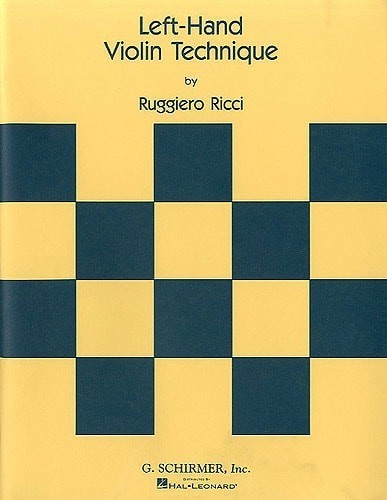

This website is a transcription of the book Left-Hand Violin Technique by Ruggiero Ricci. 

It is built with the website builder [Jekyll](https://jekyllrb.com) using the [Ed](https://minicomp.github.io/ed/) theme. 

You can view the source code in the [github repository](https://github.com/javiermontanana/ricci-left-hand).

The examples were engraved using [Lilypond](https://lilypond.org/) and [Frescobaldi](https://www.frescobaldi.org/), exported as SVG and then included in the HTML code. 

The book is transcribed verbatim with a few small changes: 

- In the printed book, the chapter structure is not very clear so I've made my own interpretation of Chords being the first chapter and Shifting being the second, each with three sections. 
- In a couple of places I've added subheadings for grouping the examples by keys. 
- Where the numbering of examples seemed inconsistent, I've made up a numbering. 
- In the chapter Left Hand Pizzicato, the examples are very long. I have listed them but not transcribed them. They are printed in the book, but if you're interested, you can find the music those elsewhere. 

Other than those changes, all the content in the book is transcribed in this website. 

If you want to get in touch with any feedback or questions, send me an email to [javier.montanana@gmail.com](mailto:javier.montanana@gmail.com)

One of our most pressing and ever-evolving needs as scholars is to pass on our textual artifacts
from one generation to another. The art of textual editing, among other practices, has helped many
cultures to remember and interpret for centuries. Alas, that art is practiced and encouraged in its
highest form by a dwindling number of scholars. In a digital environment the problem is compounded
by the difficulties of the medium. While vast repositories and "e-publications" appear on the
online scene yearly, very few manifest a textual scholar's disciplined attention to detail. In
contrast, most textual scholars who have made the leap to a rigorous digital practice have focused
on markup, relying on technical teams to deploy and maintain their work. This makes your average
scholarly digital edition a very costly and therefore limited affair.

As we see it, a minimal edition is one that aims to reduce the size and complexity of the back and
front end while flattening the learning curves for the user and the producer. Out of the box, the Ed
theme can help you build a simple reading edition, or a traditional scholarly edition with footnotes
and a bibliography, without breaking the bank. In our estimate, these are the two most immediately
useful type of editions for editors and readers. An edition produced with Ed consists of static
pages whose rate of decay is substantially lower than database-driven systems. As an added bonus,
these static pages require less bandwidth. Our hope is that our approach can help beginners and
veterans deploy beautiful editions with less effort, and that it can help us teach a 'full stack'
[in one academic semester](https://github.com/susannalles/MinimalEditions/blob/master/README.md),
while allowing us to care for our projects at less cost, and perhaps, just perhaps, to generate
high-quality editions on github.io in large quantities based on the
[git-lit](http://jonreeve.com/2015/09/introducing-git-lit/) model by Jonathan Reeve. We're coming
for you, Kindle!

## Sample Ed editions.

- [Our sample site](http://minicomp.github.io/ed/) is the first edition built with Ed.
- [Fugitive Verses](http://fugitiverses.viraltexts.org/): Popular Reprinted Poetry from Nineteenth Century Newspapers
- [mini lazarillo](http://minilazarillo.github.io/): A minimal edition of the *Lazarillo de Tormes*
- [Making and Knowing](https://cu-mkp.github.io/GR8975-edition/): The BnF Ms Fr 640 in Translation
- [Daisy Miller: A Comedy in Three Acts](https://britaneeelizabeth.github.io/ed/texts/DaisyMillerPlay/)

## Current Features

- Templates for narrative, drama and poetry
- Responsive design for mobile phones, tablets and PCs.
- Relatively easy to learn and teach
- Works well in high- or low- bandwidth scenarios
- Easier for digital archives and libraries to preserve
- Open source, open access
- Unobtrusive footnotes
- Metadata in Dublin Core and OpenGraph to play nice with Zotero, libraries and social media.
- Automatic table of content generation
- Simple search functionality
- Annotations via [hypothes.is](https://hypothes.is/)
- Optional: Ability to generate well-formatted bibliographies and linked citations

## Installing and using Ed

To learn how to install and begin using Ed, please visit our
[documentation page](http://minicomp.github.io/ed/documentation).
